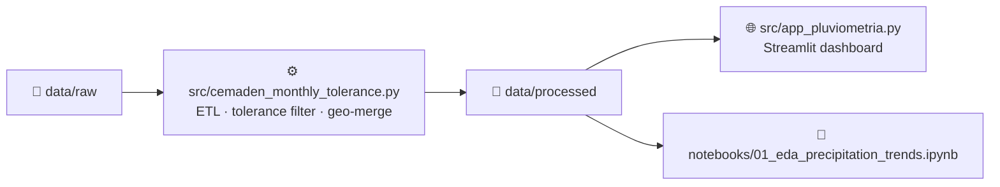

# Mapa Pluviométrico BR 🌧️

Interactive analysis of monthly precipitation from CEMADEN / UNIPLU-BR monitoring stations across Brazil — **100% Python**, powered by Streamlit and Plotly.

---

## Architecture



### Key components

| Component | Purpose |
|---|---|
| `src/cemaden_monthly_tolerance.py` | ETL: daily → monthly aggregation with 90% completeness filter |
| `src/app_pluviometria.py` | Streamlit interactive dashboard |
| `notebooks/01_eda_precipitation_trends.ipynb` | Reproducible EDA notebook |
| `data/raw/` | Raw input CSVs (daily records + station metadata) |
| `data/processed/` | Clean, analysis-ready CSV outputs |
| `matlab_archive/` | Archived legacy MATLAB scripts (preserved for history, not used) |

---

## Why We Migrated from MATLAB to Python

The previous architecture used a hybrid MATLAB + Python workflow. This caused repeated friction:

| Pain Point | Resolution |
|---|---|
| **Absolute path errors** | Python `pathlib.Path` with relative references — works on any machine |
| **Proprietary MATLAB license** | Fully open-source stack: pandas, plotly, streamlit |
| **Blocking UI** | Streamlit runs as a non-blocking web app; shareable via URL |
| **No cross-platform reproducibility** | `requirements.txt` + `venv` — identical environment on Windows, macOS, Linux |
| **Manual Mann-Kendall (`ktaub.m`)** | Replaced by `pymannkendall` (pip-installable, tested, documented) |
| **MATLAB file exchange (`.mat`)** | Output is standard CSV / Parquet, readable by any tool |

The MATLAB scripts are preserved in `matlab_archive/` for historical reference.

---

## Setup Instructions

### 1. Clone and create a virtual environment

```bash
python cemaden_monthly_tolerance.py daily_input.csv \
	--output-csv cemaden_monthly_tolerance.csv \
	--max-missing-days 3 \
	--min-completeness 0.90
```

### Programmatic Usage

```python
from cemaden_monthly_tolerance import (
		aggregate_daily_to_monthly,
		merge_monthly_with_metadata,
		export_monthly_filtered_to_mat,
)

# 1) Monthly aggregation with tolerance
df_monthly = aggregate_daily_to_monthly(df_cemaden_daily, 3, 0.90)

# 2) Example filtered monthly frame (expected columns: gauge_code, year, month, rain_mm)
# df_monthly_filtered = ...

# 3) Merge monthly values with station metadata
df_monthly_with_geo = merge_monthly_with_metadata(df_monthly_filtered, df_total_info)

# 4) Export filtered monthly table to MATLAB
export_monthly_filtered_to_mat(df_monthly_filtered, 'dados_hidro_br_mensal.mat')
```

### Dependencies

- `pandas`
- `scipy`

## Repository Organization

To reduce clutter and keep processing artifacts separated from source files:

1. Generated outputs are stored in [outputs](outputs).
2. MATLAB analysis scripts are stored in [scripts/matlab](scripts/matlab).
3. Python helper script folders are available in [scripts/python](scripts/python).

### New MATLAB Interactive Panel Script

Use [scripts/matlab/uniplu_station_panel.m](scripts/matlab/uniplu_station_panel.m) to:

1. Load `dados_hidro_br_mensal.mat`.
2. Select a state (`listdlg`).
3. Select a station (`city | gauge_code`).
4. Display three vertical panels (`tiledlayout(3,1)`):
	- data availability (month x year),
	- monthly hyetograph,
	- annual totals with Mann-Kendall/Sen trend summary via `ktaub`.