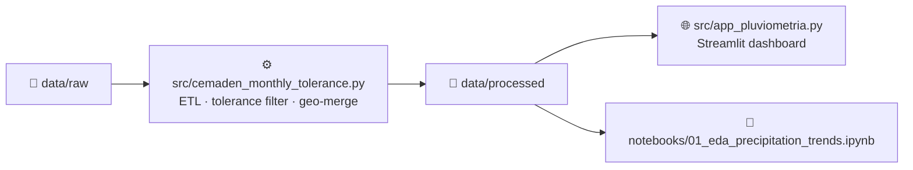

# Mapa Pluviométrico BR 🌧️

Interactive analysis of monthly precipitation from CEMADEN / UNIPLU-BR monitoring stations across Brazil — **100% Python**, powered by Streamlit and Plotly.

---

## Architecture



### Key components

| Component | Purpose |
|---|---|
| `src/cemaden_monthly_tolerance.py` | ETL: daily → monthly aggregation with 90% completeness filter |
| `src/app_pluviometria.py` | Streamlit interactive dashboard |
| `notebooks/01_eda_precipitation_trends.ipynb` | Reproducible EDA notebook |
| `data/raw/` | Raw input CSVs (daily records + station metadata) |
| `data/processed/` | Clean, analysis-ready CSV outputs |
| `matlab_archive/` | Archived legacy MATLAB scripts (preserved for history, not used) |

---

## Why We Migrated from MATLAB to Python

The previous architecture used a hybrid MATLAB + Python workflow. This caused repeated friction:

| Pain Point | Resolution |
|---|---|
| **Absolute path errors** | Python `pathlib.Path` with relative references — works on any machine |
| **Proprietary MATLAB license** | Fully open-source stack: pandas, plotly, streamlit |
| **Blocking UI** | Streamlit runs as a non-blocking web app; shareable via URL |
| **No cross-platform reproducibility** | `requirements.txt` + `venv` — identical environment on Windows, macOS, Linux |
| **Manual Mann-Kendall (`ktaub.m`)** | Replaced by `pymannkendall` (pip-installable, tested, documented) |
| **MATLAB file exchange (`.mat`)** | Output is standard CSV / Parquet, readable by any tool |

The MATLAB scripts are preserved in `matlab_archive/` for historical reference.

---

## Setup Instructions

### 1. Clone and create a virtual environment

```bash
git clone <repo-url>
cd mapa-pluviometrico-matlab

python -m venv venv
# Windows
venv\Scriptsctivate
# macOS / Linux
source venv/bin/activate
```

### 2. Install dependencies

```bash
pip install -r requirements.txt
```

### 3. Run the ETL pipeline

**Option A — from raw daily CSV:**
```bash
python src/cemaden_monthly_tolerance.py data/raw/df_cemaden_daily.csv     --output-csv data/processed/df_monthly_filtered.csv     --output-with-geo-csv data/processed/df_monthly_filtered_with_geo.csv
```

**Option B — from UNIPLU-BR ZIP files:**
```bash
python src/cemaden_monthly_tolerance.py     --data-dir UNIPLU_BR-dados     --states RS,SC     --years 2022,2023,2024     --output-csv data/processed/df_monthly_filtered.csv     --output-with-geo-csv data/processed/df_monthly_filtered_with_geo.csv
```

### 4. Launch the Streamlit dashboard

```bash
streamlit run src/app_pluviometria.py
```

Open [http://localhost:8501](http://localhost:8501) in your browser.

### 5. Run the EDA notebook

```bash
jupyter notebook notebooks/01_eda_precipitation_trends.ipynb
```

---

## Data Description

| Column | Type | Description |
|---|---|---|
| `gauge_code` | string | Unique station identifier |
| `year` | int | Calendar year |
| `month` | int | Calendar month (1–12) |
| `rain_mm` | float | Monthly precipitation total (mm). NaN = invalid month |
| `lat` / `long` | float | Station coordinates (WGS-84) |
| `city` | string | Municipality |
| `state` | string | Brazilian state (UF) |
| `network` | string | Monitoring network (e.g., CEMADEN) |

---

## License

See [LICENSE](LICENSE).
